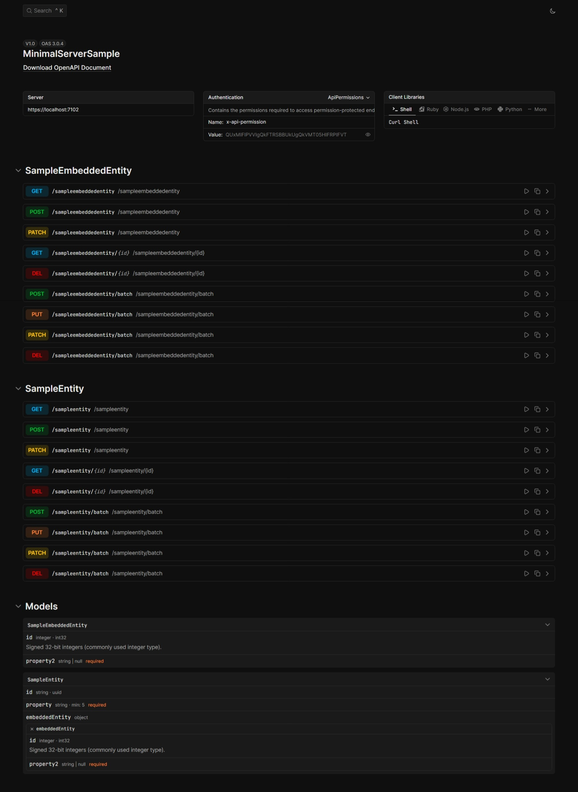

<a href="https://www.nuget.org/packages/Russkyc.MinimalApi.Framework">
    
</a>

<h2 align="center">Russkyc.MinimalApi.Framework - Create Rest API's with minimal configuration</h2>

<p align="center">
    
    
    
    
    
</p>

Dynamically generates a generic CRUD API implementation
backed with Entity Framework Core and Minimal API. This can be used
to create a quick backend for prototyping apps that use CRUD operations.



## 📓 Table of Contents

1. [What's New](#whats-new)
2. [Potential Use-Cases](#potential-use-cases)
3. [Getting Started](#getting-started)
   - [Installation](#installation)
   - [Minimal Setup](#minimal-setup)
   - [Standard Setup](#standard-setup)
4. [Configuration](#configuration)
   - [FrameworkOptions](#frameworkoptions)
   - [FrameworkDbContextOptions](#frameworkdbcontextoptions)
   - [FrameworkApiDocsOptions](#frameworkapidocsoptions)
   - [FrameworkRealtimeOptions](#frameworkrealtimeoptions)
5. [Advanced Features](#advanced-features)
   - [Advanced Querying](#advanced-querying)
   - [Batch Endpoints](#batch-endpoints)
   - [Data Annotations Validation](#data-annotations-validation)
   - [Permissions Based Access Control](#permissions-based-access-control)
   - [Realtime Support](#realtime-support)
6. [Special Thanks](#special-thanks)

## ✨ What's New (v1.0.0):
- Scalar API Docs integration
- Shorter setup code for new projects [learn more...](#getting-started)
- Support for permission control in endpoints [learn more...](#permissions-based-access-control)

## ❔ Potential Use-Cases

- Quick API prototyping
- Small projects that only require CRUD functionality
- Frontend Testing (if a backend API is needed)

## 🎉 Getting Started

### Installation

To install the `Russkyc.MinimalApi.Framework` package, you can use the NuGet Package Manager or the .NET CLI.

Follow these steps to set up the `Russkyc.MinimalApi.Framework` in your project.

1. **Create a new ASP.NET Core Web API project** if you don't already have one.
2. **Install the `Russkyc.MinimalApi.Framework` NuGet package** using the cli or the nuget package manager
3. **Install an EntityFramework Provider** like `Microsoft.EntityFrameworkCore.InMemory` or `Microsoft.EntityFrameworkCore.Sqlite` depending on your database choice.
2. **Add the required services, configuration, and mappings** in the `Program.cs` file:

There are two options for setting up the framework in your project, a minimal setup and a more granular standard setup.

### Minimal Setup

```csharp
using System.ComponentModel.DataAnnotations;
using Microsoft.EntityFrameworkCore;
using Russkyc.MinimalApi.Framework;
using Russkyc.MinimalApi.Framework.Core;
using Russkyc.MinimalApi.Framework.Core.Access;
using Russkyc.MinimalApi.Framework.Core.Attributes;

await MinimalApiFramework
    .CreateDefault(options => options.UseSqlite("Data Source=test.sqlite"))
    .RunAsync();

// Define your entity classes here or in a separate file
```

See the [Minimal Sample Project](https://github.com/russkyc/minimalapi-framework/tree/master/MinimalServerSample) for the complete code.

### Standard Setup

```csharp
using System.ComponentModel.DataAnnotations;
using Microsoft.EntityFrameworkCore;
using Russkyc.MinimalApi.Framework.Core;
using Russkyc.MinimalApi.Framework.Core.Access;
using Russkyc.MinimalApi.Framework.Core.Attributes;
using Russkyc.MinimalApi.Framework.Extensions;
using Russkyc.MinimalApi.Framework.Options;

var builder = WebApplication.CreateBuilder();

// Configure
FrameworkOptions.MapIndexToApiDocs = true;
FrameworkDbContextOptions.DbContextConfiguration = options => options.UseSqlite("Data Source=test.sqlite");

// Add required services
builder.Services
    .AddMinimalApiFramework();

var webApplication = builder.Build();

// Add required endpoints
// Optionally, you can disable entity endpoints mapping and map them manually
webApplication.UseMinimalApiFramework(mapEntityEndpoints: false);

// If mapping is disabled, you can manually map entity endpoints
// Manual entity endpoints mapping for more granular control
webApplication.MapEntityEndpoints<SampleEntity, Guid>(options =>
{
    // Other endpoint options can be configured here
});

// Sample prefixed mapping
// Same effect can be achieved when using the minimal setup
// by using the `FrameworkOptions` and setting `ApiPrefix`
var apiGroup = webApplication.MapGroup("nested");
apiGroup.MapEntityEndpoints<SampleEmbeddedEntity, int>();

await webApplication.RunAsync();

// Define your entity classes here or in a separate file

```

See the [Standard Sample Project](https://github.com/russkyc/minimalapi-framework/tree/master/StandardServerSample) for the complete code.

## 🔧 Configuration

The framework provides several static options classes to customize its behavior.
You can set these options before your application startup in your `Program.cs`.

### FrameworkOptions

```csharp
using System.Reflection;

public static class FrameworkOptions
{
    public static Assembly? EntityClassesAssembly { get; set; } = null;
    public static bool EnableRealtimeEvents { get; set; } = true;
    public static bool MapIndexToApiDocs { get; set; } = true;
    public static bool EnableApiDocs { get; set; } = true;
    public static string? ApiPrefix { get; set; }
    public static string PermissionHeader { get; set; } = "x-api-permission";
}
```

**Properties:**
- `EntityClassesAssembly`: The assembly containing your entity classes. (default: `null`)
- `EnableRealtimeEvents`: Enable or disable SignalR-based realtime events. (default: `true`)
- `MapIndexToApiDocs`: Map the root index to API docs. (default: `true`)
- `EnableApiDocs`: Enable or disable API documentation. (default: `true`)
- `ApiPrefix`: Set a custom API route prefix. (default: `null`)
- `PermissionHeader`: The HTTP header used for permission checks. (default: `"x-api-permission"`)

### FrameworkDbContextOptions

```csharp
using Microsoft.EntityFrameworkCore;
using Russkyc.MinimalApi.Framework.Core;

public static class FrameworkDbContextOptions
{
    public static Type? DbContextType { get; set; } = null;
    public static ServiceLifetime DbContextLifetime { get; set; } = ServiceLifetime.Scoped;
    public static ServiceLifetime DbContextOptionsLifetime { get; set; } = ServiceLifetime.Scoped;
    public static Action<DbContextOptionsBuilder>? DbContextConfiguration { get; set; } = null;
    public static DatabaseAction DatabaseAction { get; set; } = DatabaseAction.EnsureCreated;
}
```

**Properties:**
- `DbContextType`: Custom `DbContext` type to use. (default: `null`)
- `DbContextLifetime`: Service lifetime for the DbContext. (default: `Scoped`)
- `DbContextOptionsLifetime`: Service lifetime for DbContext options. (default: `Scoped`)
- `DbContextConfiguration`: Action to further configure the `DbContextOptionsBuilder`. (default: `null`)
- `DatabaseAction`: Database initialization action (`None`, `EnsureCreated`, `DeleteAndCreate`). (default: `EnsureCreated`)

#### Using a custom DbContext

We can define a custom `DbContext` class that inherits from `BaseDbContext`. This can be configured using one of the properties in the `FrameworkDbContextOptions` class.

Sample Custom DbContext Class

```csharp
using Microsoft.EntityFrameworkCore;
using Russkyc.MinimalApi.Framework;

namespace SampleProject;

public class CustomDbContext : BaseDbContext
{
    public CustomDbContext(DbContextOptions options) : base(options)
    {
    }
    
    // Entity collections are required to be defined
    // using the naming convention `<ClassName>Collection`
    
    public DbSet<SampleEmbeddedEntity> SampleEmbeddedEntityCollection { get; set; }
    public DbSet<SampleEntity> SampleEntityCollection { get; set; }
}
```

Configuration

```csharp
FrameworkDbContextOptions.DbContextType = typeof(CustomDbContext);
FrameworkDbContextOptions.DatabaseAction = DatabaseAction.EnsureCreated;
FrameworkDbContextOptions.DbContextConfiguration = options =>
{
    options.UseSqlite("Data Source=test.sqlite");
};
```

### FrameworkApiDocsOptions

```csharp
using Scalar.AspNetCore;

public static class FrameworkApiDocsOptions
{
    public static bool EnableSidebar { get; set; } = false;
    public static ScalarLayout Layout { get; set; } = ScalarLayout.Classic;
    public static ScalarTheme Theme { get; set; } = ScalarTheme.Default;
}
```

**Properties:**
- `EnableSidebar`: Show or hide the sidebar in API docs. (default: `false`)
- `Layout`: API docs layout (`Classic`, etc.), options are `ScalarLayout.Modern` and `ScalarLayout.Classic`. (default: `ScalarLayout.Classic`)
- `Theme`: API docs theme provided by scalar, options are available in the `ScalarTheme` enum. (default: `ScalarTheme.Default`).

### FrameworkRealtimeOptions

```csharp
using Russkyc.MinimalApi.Framework.Core;

public static class FrameworkRealtimeOptions
{
    public static string RealtimeEventsEndpoint { get; set; } = ConfigurationStrings.RealtimeHubEndpoint;
}
```

**Properties:**
- `RealtimeEventsEndpoint`: The SignalR endpoint for realtime events. (default: `/crud-events`)

## ⚡ Advanced Features

### Advanced Querying

Apart from the standard CRUD api functionality, there is also some support for
advanced querying.

#### Entity Framework Core Navigation Properties

If you do a get request to the endpoint `/api/sampleentity` you will
receive a response that looks like this:

```json
[
  {
    "id": 1,
    "property": "Entity 1",
    "embeddedEntity": null
  },
  {
    "id": 2,
    "property": "Entity 2",
    "embeddedEntity": null
  },
  {
    "id": 3,
    "property": "Entity 3",
    "embeddedEntity": null
  },
  {
    "id": 4,
    "property": "Entity 4",
    "embeddedEntity": null
  }
]
```

This is because navigation properties for referenced entities are not
automatically included (for performance purposes). you can use the `include`
query parameter to include the referenced entity when needed.

```http
GET /api/sampleentity?include=embeddedentity
```

Then you will have this result:

```json
[
  {
    "id": 1,
    "property": "Entity 1",
    "embeddedEntity": {
      "id": 1,
      "property2": "Embedded Entity 1"
    }
  },
  {
    "id": 2,
    "property": "Entity 2",
    "embeddedEntity": {
      "id": 2,
      "property2": "Embedded Entity 2"
    }
  },
  {
    "id": 3,
    "property": "Entity 3",
    "embeddedEntity": {
      "id": 3,
      "property2": "Embedded Entity 3"
    }
  },
  {
    "id": 4,
    "property": "Entity 4",
    "embeddedEntity": {
      "id": 4,
      "property2": "Embedded Entity 4"
    }
  }
]
```

#### Filter query support (with the help of DynamicExpressionParser in System.Linq.Dynamic.Core)

Entities can now be filtered with the `filter` queryParam and supports standard expressions. Here are a few
examples:

```http
GET /api/sampleentity?filter=Content.StartsWith("hello")
```

```http
GET /api/sampleentity?filter=Content.StartsWith("hi") && !Content.Contains("user")
```

```http
GET /api/sampleentity?filter=Count == 1 || Count > 8
```

```http
GET /api/sampleentity?filter=ContactPerson != null
```

These are visualized for readability, in actual use, the filter value should be URL Encoded.

#### Ordering Support

Entities can be ordered using the `orderBy` and `orderByDescending` query parameters. Multiple properties can be specified for ordering, separated by commas. The first property will be ordered using `OrderBy` or `OrderByDescending`, and subsequent properties will be ordered using `ThenBy` or `ThenByDescending`.

```http
GET /api/sampleentity?orderBy=property,embeddedEntity.property2&orderByDescending=true
```
the `orderBy` query param will define what properties are taken into consideration in ordering.
the `orderByDescending` query param is a bool property that changes the behavior to descending when set to true.
#### Pagination

By default, pagination is disabled and the query collection response returns something like this

```json
[
  {
    "id": 1,
    "property": "Entity 1",
    "embeddedEntity": {
      "id": 1,
      "property2": "Embedded Entity 1"
    }
  },
  {
    "id": 2,
    "property": "Entity 2",
    "embeddedEntity": {
      "id": 2,
      "property2": "Embedded Entity 2"
    }
  }
]
```

To enable pagination, set the `paginate` query param to true
and set the `page`, `pageSize` query params as needed. as an example:

```http
GET /api/sampleentity?paginate=true&page=1&pageSize=1
```

This will now return a `PaginatedCollection` object with this JSON schema:

```json
{
  "data": [
    {
      "property": "Entity 1",
      "embeddedEntity": null,
      "id": "84e93f60-b2bc-4303-af0a-c51c205addb9"
    }
  ],
  "page": 1,
  "pageSize": 1,
  "totalRecords": 2,
  "totalPages": 2
}
```

### Batch Endpoints

Batch endpoints are supported for adding, updating, and deleting multiple entities at once.

#### Batch Insert

```http
POST /api/sampleentity/batch
Content-Type: application/json

[
  {
    "id": 1,
    "property": "Entity 1",
    "embeddedEntity": null
  },
  {
    "id": 2,
    "property": "Entity 2",
    "embeddedEntity": null
  }
]
```

#### Batch Update

```http
PUT /api/sampleentity/batch
Content-Type: application/json

[
  {
    "id": 1,
    "property": "Updated Entity 1",
    "embeddedEntity": null
  },
  {
    "id": 2,
    "property": "Updated Entity 2",
    "embeddedEntity": null
  }
]
```

#### Batch Update with Filters and Dynamic Fields

```http
PATCH /api/sampleentity/batch?filter=@property.Contains("Old")
Content-Type: application/json

{
  "property": "Updated Value"
}
```

#### Batch Delete

```http
DELETE /api/sampleentity/batch?filter=@Count > 8
```

### Data Annotations Validation
Properties with data annotations such as `[Required]`, `[StringLength]`, and others will now be validated automatically
when creating entities. If validation fails, a `400 Bad Request` response will be returned with the validation errors.

**Example Class**
```csharp
using System.ComponentModel.DataAnnotations;
using Russkyc.MinimalApi.Framework.Core;

public class SampleEntity : DbEntity<Guid>
{
    [Required, MinLength(5)]
    public string Property { get; set; }
}
```
When Validation fails, a `400 Bad Request` response will be returned with this class as the response body:

**Validation Error Class**
```csharp
public class ValidationError
{
    public string Message { get; set; }
    public IDictionary<string,string[]> Errors { get; set; }
}
```

> [!NOTE]
> Data validation is implemented using [MiniValidation](https://github.com/DamianEdwards/MiniValidation). Fluent validation interfaces are not supported.

### Permissions Based Access Control

The framework supports permission control at the entity level using the `[RequirePermission]` attribute. This allows you to restrict access to specific API methods (GET, POST, PUT, PATCH, DELETE) based on custom permissions.

#### Usage

To require permissions for certain API methods on an entity, decorate the entity class with the `[RequirePermission]` attribute. You can specify multiple permissions and apply the attribute multiple times for different methods.

**Example:**
```csharp
using Russkyc.MinimalApi.Framework.Core.Access;
using Russkyc.MinimalApi.Framework.Core.Attributes;

[RequirePermission(ApiMethod.Post, "create_permission")]
[RequirePermission(ApiMethod.Get, "read_permission")]
public class SampleEntity : DbEntity<Guid>
{
    // ...properties...
}
```

- `ApiMethod`: The HTTP method to restrict (e.g., `ApiMethod.Get`, `ApiMethod.Post`).
- `permission`: One or more permission strings required to access the endpoint.

#### How it works

When a request is made to an endpoint with permission control, the framework checks for the required permission(s) in the HTTP header defined by `FrameworkOptions.PermissionHeader` (default: `x-api-permission`).

If the required permission is not present in the header, the request will be rejected with a `403 Forbidden` response.

**Example request:**
```http
GET /api/sampleentity
x-api-permission: read_permission
```

You can customize the header name by setting:
```csharp
FrameworkOptions.PermissionHeader = "your-custom-header";
```

#### Multiple Permissions

If multiple permissions are specified, the request must include at least one of the required permissions in the header value (comma-separated if multiple).

**Example:**
```csharp
[RequirePermission(ApiMethod.Get, "perm1", "perm2")]
```

**Request:**
```http
GET /api/sampleentity
x-api-permission: perm2
```

- Permission checks are only enforced for endpoints and methods decorated with `[RequirePermission]`.
- If no `[RequirePermission]` attribute is present, the endpoint is accessible without permission checks.
- You can apply multiple `[RequirePermission]` attributes to the same class for different methods.

> [!WARNING]
> Header-based permission control is a simple approach and should not be considered as secure as standard methods like JWT, Cookie, or Basic Authentication.
> For public or production environments that require strong security, use .NET `Authentication`/`Authorization` with JWT or a custom authentication solution instead of static permission strings.

### Realtime Support

Realtime events are enabled by default and can be used to receive updates
when entities are created, updated, or deleted and is implemented using SignalR.

We can enable or disable realtime events in the server by setting the `EnableRealtimeEvents` property in the `FrameworkOptions` class.

```csharp
FrameworkOptions.EnableRealtimeEvents = true; // or false to disable
```

The default SignalR endpoint for realtime events is `/realtime-events`, but you can change it by setting the `RealtimeEventsEndpoint` property in the `FrameworkRealtimeOptions` class.

```csharp
FrameworkRealtimeOptions.RealtimeEventsEndpoint = "/api-events"; // Custom endpoint
```

#### Sample Realtime Client Code

```csharp
using System.Text.Json;
using Microsoft.AspNetCore.SignalR.Client;
using Russkyc.MinimalApi.Framework.Core;

// ConfigurationStrings.RealtimeHubEndpoint provides the default SignalR endpoint for realtime events.
var connection = new HubConnectionBuilder()
    .WithUrl($"https://localhost:7102{ConfigurationStrings.RealtimeHubEndpoint}", options =>
    {
        // If you have enabled permission control in some endpoints, you need to set the required permission
        // in order to receive realtime events for those endpoints.
        options.Headers.Add(ConfigurationStrings.ApiPermissionHeader, "xcxs");
    })
    .WithAutomaticReconnect()
    .Build();

connection.On<RealtimeEvent>(ConfigurationStrings.RealtimeEvent, obj =>
{
    var serialized = JsonSerializer.Serialize(obj, new JsonSerializerOptions()
    {
        WriteIndented = true
    });
    Console.WriteLine(serialized);
});

await connection.StartAsync();
Console.Read();
```

See the [Minimal Client Sample Project](https://github.com/russkyc/minimalapi-framework/tree/master/MinimalClientSample) for the complete code.

Each event returned is an `EntityEvent<T>` type, where T is the type of data
returned by the resource event that triggered the websocket message. Eg; when
creating a `SampleEntity` using `post` the `EntityEvent` being sent in realtime is of
type `EntityEvent<SampleEntity>`.

#### EntityEvent Schema

```csharp
public class EntityEvent<T>
{
    public string Resource { get; set; }
    public string Type { get; set; }
    public T? Data { get; set; }
}
```

- The `Resource` property will be the name of the entity in lowercase, eg; "sampleentity".
- The `Type` property will be the type of event, eg; `created`, `updated`, `deleted`, `batch-created`, `batch-updated`, `batch-deleted`
- The `Data` property contains the data being returned by that resource method.

## 💝 Donate and Support Development

This is free and available for everyone to use, but still requires time for development
and maintenance. By choosing to donate, you are not only helping develop this project,
but you are also helping me dedicate more time for creating more tools that help the community :heart:

## 💎 Special Thanks

This project may exists with the help of these amazing open-source projects:

- [Scalar](https://github.com/scalar/scalar) - Used as the API documentation.
- [System.Linq.Dynamic.Core](https://github.com/zzzprojects/System.Linq.Dynamic.Core) - Used as the expression parser in advanced querying.
- [MiniValidation](https://github.com/DamianEdwards/MiniValidation) - Used for data annotations validation.
- [Entity Framework Core](https://github.com/dotnet/efcore) - For Database Access.
- [SignalR](https://github.com/SignalR/SignalR) - For the realtime events.

This project is made easier to develop by Jetbrains! They have provided
Licenses to their IDE's to support development of this open-source project.

<a href="https://www.jetbrains.com/community/opensource/#support">

</a>