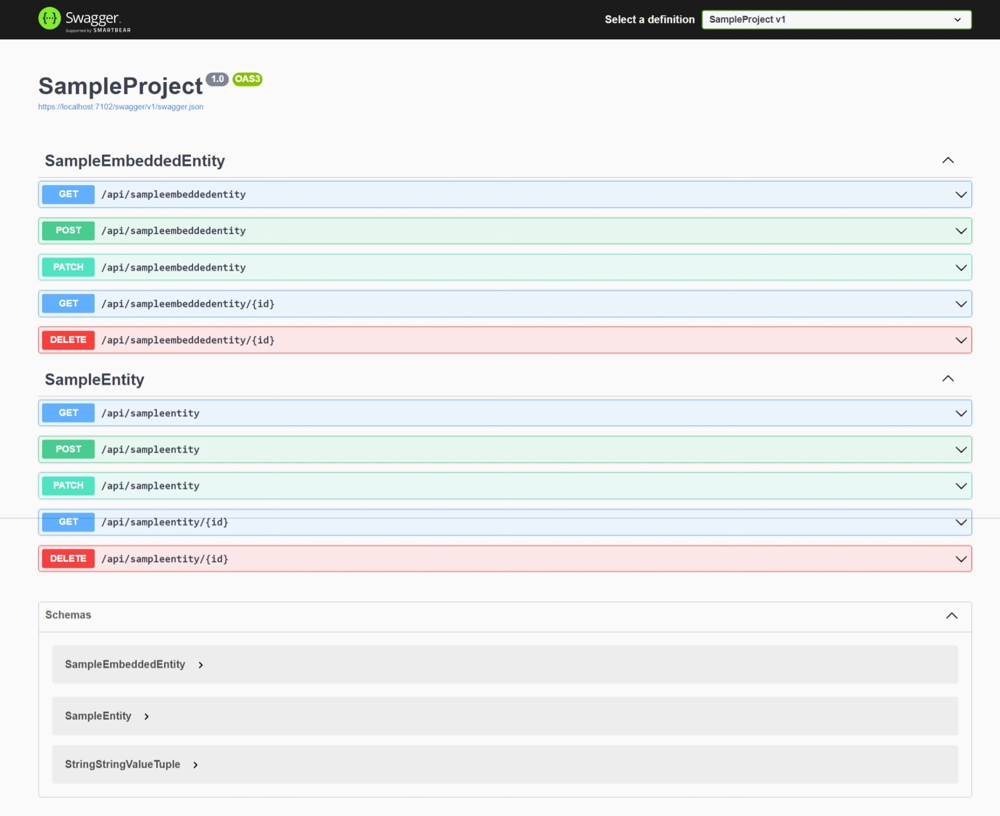


<h2 align="center">Russkyc.MinimalApi.Framework - A generic Minimal API Crud Generator</h2>

This project demonstrates a minimal API using ASP\.NET Core with Entity Framework Core. It includes features for
dynamically adding and mapping entity services and endpoints based on custom attributes.



## How It Works

1. **Attributes**: Use `DbEntityAttribute` to mark classes as database entities and `QueryableAttribute` to mark
   properties as queryable.
2. **Extensions**: Use extension methods to add entity services and map endpoints dynamically.
3. **Entity Context**: A generic `EntityContext<T>` class is used to manage database operations for entities.

## Usage

### Example Entity

```csharp
[DbEntity]
public class SampleEntity
{
    [Key]
    [Queryable]
    public int Id { get; set; }
    [Queryable]
    public string Property { get; set; }
    public virtual SampleEmbeddedEntity EmbeddedEntity { get; set; }
}
```

### Program Setup

With minimal setup, you can now have a working CRUD API with either of the two setup options:

#### 1. Auto Discovery of Entities

```csharp
var builder = WebApplication.CreateBuilder(args);

builder.Services.AddEndpointsApiExplorer();
builder.Services.AddSwaggerGen();
var assembly = Assembly.GetExecutingAssembly();

builder.Services.AddAllEntityServices(assembly, options => options.UseInMemoryDatabase("sample"));

var app = builder.Build();

if (app.Environment.IsDevelopment())
{
    app.UseSwagger();
    app.UseSwaggerUI();
}

app.UseHttpsRedirection();

app.MapGroup("api").MapAllEntityEndpoints(assembly);

app.Run();
```

#### 2. Single Entity Registration

```csharp
var builder = WebApplication.CreateBuilder(args);

builder.Services.AddEndpointsApiExplorer();
builder.Services.AddSwaggerGen();

builder.Services.AddEntityServices<SampleEntity>(options => options.UseInMemoryDatabase("sample"));

var app = builder.Build();

if (app.Environment.IsDevelopment())
{
    app.UseSwagger();
    app.UseSwaggerUI();
}

app.UseHttpsRedirection();

app.MapGroup("api").MapEntityEndpoints<SampleEntity>();

app.Run();
```

## Examples

### Querying Entities via API

#### Get All Entities

```http
GET /api/sampleentity
```

#### Get All Entities with Includes

```http
GET /api/sampleentity?include=embeddedentity
```

#### Get All Entities with Filters

```http
GET /api/sampleentity?filters=property=CONTAINS(Example)
```

#### Get All Entities with Property Selection

```http
GET /api/sampleentity?property=Id,Property
```

#### Get All Entities with Includes, Filters, and Property Selection

```http
GET /api/sampleentity?include=embeddedentity&filters=property=CONTAINS(Example)&property=Id,Property
```

#### Get Single Entity by ID

```http
GET /api/sampleentity/1
```

#### Get Single Entity by ID with Includes

```http
GET /api/sampleentity/1?include=embeddedentity
```

#### Get Single Entity by ID with Property Selection

```http
GET /api/sampleentity/1?property=Id,Property
```

#### Get Single Entity by ID with Includes and Property Selection

```http
GET /api/sampleentity/1?include=embeddedentity&property=Id,Property
```

### Wildcards in Filters

You can use wildcards in the `filters` query parameter to perform more flexible searches:

- **CONTAINS**: Matches entities where the property contains the specified value.
  ```http
  GET /api/sampleentity?filters=property=CONTAINS(Example)
  ```

- **STARTSWITH**: Matches entities where the property starts with the specified value.
  ```http
  GET /api/sampleentity?filters=property=STARTSWITH(Exa)
  ```

- **ENDSWITH**: Matches entities where the property ends with the specified value.
  ```http
  GET /api/sampleentity?filters=property=ENDSWITH(mple)
  ```

- **GREATERTHAN**: Matches entities where the property is greater than the specified value.
  ```http
  GET /api/sampleentity?filters=property=GREATERTHAN(10)
  ```

- **LESSTHAN**: Matches entities where the property is less than the specified value.
  ```http
  GET /api/sampleentity?filters=property=LESSTHAN(20)
  ```

## License

This project is licensed under the MIT License. See the `LICENSE` file for details.
